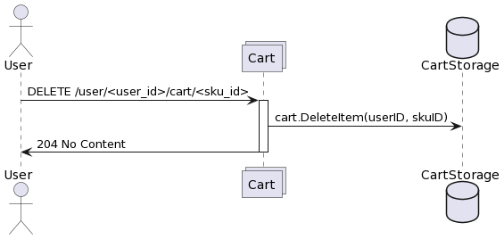
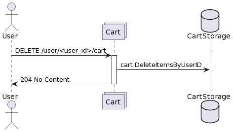
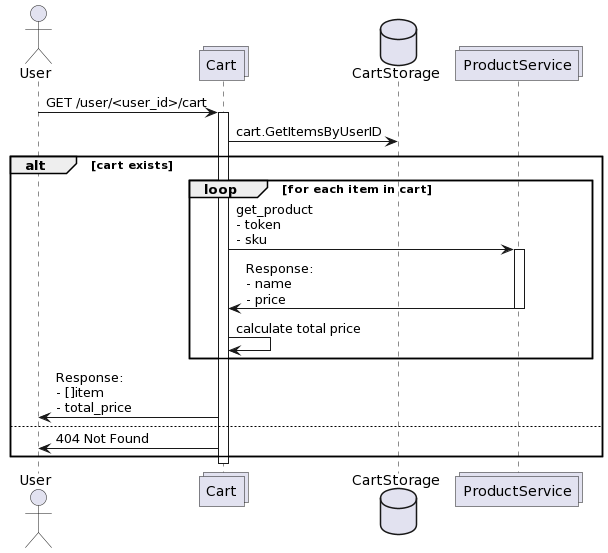
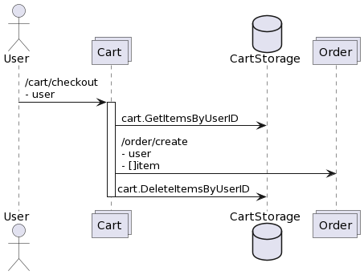

# cart - сервис корзины.

## Особенности

1. Используется HTTP, на основе стандартной библиотеки Go.
2. Для определения существования товара дела поход во внешний сервис (Product Service, который пока не реализован и работает как заглушка; не реализовано)
3. Сделан Middleware между клиентом и http-сервером, который логирует поступающие запросы.
4. Написаны unit-тесты
   - слоя UseCase(service/cart_service) для каждого запроса;
   - слоя Repository(repository/cart_storage) сервиса Cart;
   - слоя Api(api/cart_api) сервиса Cart;
   - для Closer.

   Процент покрытия тестируемых слоев более 60%.

   Для создания моков использовалась библиотека github.com/vektra/mockery/v3@v3.2.5;
5. Создан Makefile, показывающий основной функционал сервиса;
6. Существует взаимодействие с посторонним сервисом loms (см. в репозитории с аналогичным названием) по grpc (не http!).


## Взаимодействия:
## 1. Добавить товар в корзину.
   * Идентификатором товара является числовой идентификатор SKU. 
   * Метод добавляет указанный товар в корзину определенного пользователя. 
   * Каждый пользователь имеет числовой идентификатор userID. 
   * При добавлении в корзину проверяется, что товар существует в специальном сервисе.
   * Один и тот же товар может быть добавлен в корзину несколько раз, при этом количество экземпляров складывается.
   * Добавляется запрос в loms.StocksInfo для валидации кол-ва стоков.

| Метод | URI                                             |
|-------|-------------------------------------------------|
| POST  | /user/<user_id>/cart/<sku_id>                   |

### Параметры запроса
| Параметр | Тип параметра | Тип данных | Пример | Описание                                                        |
|----------|---------------|------------|--------|-----------------------------------------------------------------|
| user_id  | query path    | int64      | 1007   | Идентификатор пользователя в корзину которого добавляется товар |
| sku_id   | query path    | int64      | 2008   | Идентификатор товара, добавляемого в корзину                    |
| count    | body          | uint16     | 12     | Количество товаров, добавляемое в корзину                       |

### Параметры ответа
Отсутствуют

### Диаграмма последовательности 


## 2. Удалить товар из корзины
   * Метод полностью удаляет все количество товара из корзины пользователя. Если у пользователя вовсе нет данной позиции,
то возвращается такой же ответ, как будто бы все позиции данного sku были успешно удалены

| Метод  | URI                                             |
|--------|-------------------------------------------------|
| DELETE | /user/<user_id>/cart/<sku_id>                   |

### Параметры запроса
| Параметр | Тип параметра | Тип данных | Пример | Описание                                                        |
|----------|---------------|------------|--------|-----------------------------------------------------------------|
| user_id  | query path    | int64      | 1007   | Идентификатор пользователя в корзину которого добавляется товар |
| sku_id   | query path    | int64      | 2008   | Идентификатор товара, удаляемого из корзины                     |

### Параметры ответа
Отсутствуют

### Диаграмма последовательности:



## 3. Очистить корзину пользователя
   * Метод полностью очищает корзину пользователя. Если у пользователя нет корзины или она пуста, то как и при успешной очистке корзины необходимо вернуть код ответа 204 No Content.

| Метод  | URI                  |
|--------|----------------------|
| DELETE | /user/<user_id>/cart |

### Параметры запроса
| Параметр | Тип параметра | Тип данных | Пример | Описание                                                        |
|----------|---------------|------------|--------|-----------------------------------------------------------------|
| user_id  | query path    | int64      | 1007   | Идентификатор пользователя в корзину которого добавляется товар |

### Параметры ответа
Отсутствуют

### Диаграмма последовательности:


## 4. Получить содержимое корзины

* Метод возвращает содержимое корзины пользователя на текущий момент. Если корзины у переданного пользователя нет,
либо она пуста, следует вернуть 404 код ответа. Товары в корзине упорядочены в порядке возрастания sku.

| Метод | URI                      |
|-------|--------------------------|
| GET   | /user/<user_id>/cart     |

### Параметры запроса

| Параметр | Тип параметра | Тип данных | Пример | Описание                                                        |
|----------|---------------|------------|--------|-----------------------------------------------------------------|
| user_id  | query path    | int64      | 1007   | Идентификатор пользователя в корзину которого добавляется товар |

### Параметры ответа

| Параметр        | Тип данных | Пример                                           | Описание                                     |
|-----------------|------------|--------------------------------------------------|----------------------------------------------|
| items[i].sku_id | int64      | 2008                                             | Идентификатор товара в корзине пользователя  |
| items[i].name   | string     | "Гречка пропаренная, в пакетиках для варки, 400" | Наименование товара                          |
| items[i].count  | uint16     | 10                                               | Количество единиц товара                     |
| items[i].price  | uint32     | 16                                               | Стоимость единицы товара в условных единицах |
| total_price     | uint32     | 160                                              | Суммарная стоимость всех товаров в корзине   |


### Пример ответа

```json
{
    "items" : [
        {
            "sku_id": 2958025,
            "name": "Roxy Music. Stranded. Remastered Edition",
            "count": 2,
            "price": 1028
        },
        {
            "sku_id": 773297411,
            "name": "Кроссовки Nike JORDAN",
            "count": 1,
            "price": 2202
        }
    ],
    "total_price": 4258
}
```

### Диаграмма последовательности



## 5. Создать заказ 

* Оформляется заказ по всем товарам корзины;
* Вызывается loms.OrderCreate (см. в другом репозитории);
* Взаимодействие с LOMS - через gRPC.

| Метод | URI            |
|-------|----------------|
| POST  | /cart/checkout |



### Пример входных данных
```
{
    user int64
}
```

### Пример выходных данных
```
{
    orderID int64
}
```