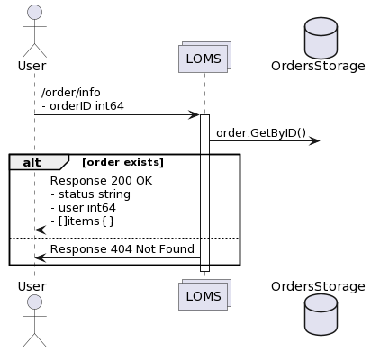
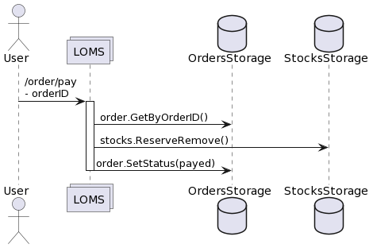
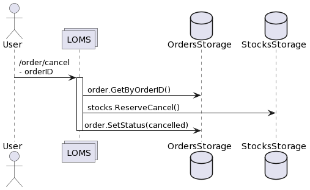
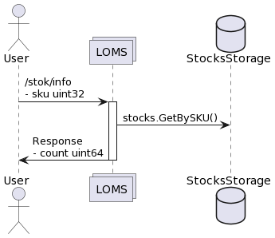

# loms (Logistics and Order Management System) - сервис, отвечающий за учет заказов и стоки по товарам.

## Особенности:
1. Используется grpc-gateway;
2. Валидация proto-структур происходит с помощью protovalidate;
3. Сервис состоит из 2 "подсервисов": Stock и Order - для каждого из которых создается свой контракт .proto;
4. Добавлен swagger-ui и возможность совершать запросы из swagger к сервису;
5. Развернута БД Postgresql для сервиса Loms;
6. Развернут экземпляр БД PostgreSQL в отдельном контейнере.

## Особенности базы данных:
1. Для сервиса loms реализован в слое Repository поход в БД;
2. В коде отмена резерва, снятие резерва и резерв являются транзакциями, состоящими из нескольких последовательных SQL запросов;
3. Реализованы автоматические миграции, накатывающие схему БД и/или тестовые данные с помощью goose;
4. SQL код написан в виде raw с помощью sqlc;
5. Поднята синхронную реплику. Происходит балансирование read/write запросы между ними (write только в master, read в любую).

## Туториал, как локально поднималась реплика к базе
1. MasterDB поднята на нестандартном порту в качестве эксперимента: localhost:54321;
2. В файловой системе MasterDB находится файл postgresql.conf, в котором нужно включить эти параметры:
    - `wal_level = replica`
    - `max_wal_senders = 10`
    - `max_replication_slots = 10`
3. В файловой системе MasterDB находится файл pg_hba.conf, в котором нужно добавить правило (или оно уже должно быть):

    - `host    replication     replicator      127.0.0.1/32    	scram-sha-256`
4. Создан пользователь для репликации:
    
    - `CREATE ROLE replicator WITH REPLICATION LOGIN PASSWORD 'test';`
5. Создан слот репликации:

    - `SELECT pg_create_physical_replication_slot('store_sync_db');`
6. В терминале выполнить:

    - `pg_basebackup \
      -h localhost -U replicator -p 5432 \
      -D ~/Library/Application\ Support/Postgres/storeSyncDB \
      -Fp -Xs -P -R \
      --slot=store_sync_db`
    - -D: Путь к каталогу данных Postgres.app (найдите точное имя в интерфейсе приложения);
    - -R: Автоматически создаёт standby.signal и настраивает postgresql.auto.conf;
    - --slot: Имя слота репликации.
    - Введите пароль пользователя replicator.
7. Для локальной реплики в каталоге данных (~/Library/Application Support/Postgres/var-<версия>) проверьте:

    - Автоматически созданный файл postgresql.auto.conf с параметрами:
   
      - `primary_conninfo = 'user=replicator password=пароль host=<IP> port=5432 sslmode=prefer'`
      - `primary_slot_name = 'replica_slot'`

    - Наличие файла standby.signal.
8. Затем проверьте работу реплики путем CRUD в мастер-реплике. Аналогичные действия должны происходить и с репликой.

## Взаимодействия:
## 1. Создание заказа (order)
* Cоздается новый заказ для пользователя из списка переданных товаров с резервированием нужного количества стоков;
* Заказ получает статус "new";
* Резервируется нужное количество единиц товара;
* Если удалось зарезервировать стоки, заказ получает статус "awaiting payment";
* Если не удалось зарезервировать стоки, заказ получает статус "failed".

| Метод | URI           |
|-------|---------------|
| POST  | /order/create |


### Пример входных данных
```
{
    user int64
    items []{
        sku uint32
        count uint16
    }
}
```

### Пример ответа
```
{
    orderID int64
}
```

## 2. Информация по заказу (order)

* Показывается информацию по заказу.

| Метод | URI                    |
|-------|------------------------|
| GET   | /order/info/{order_id} |



### Пример входных данных
```
{
    orderID int64
}
```

### Пример выходных данных
```
{
    status string // (new | awaiting payment | failed | payed | cancelled)
    user int64
    items []{
        sku uint32
        count uint16
    }
}
```

## 3. Оплатить заказ (order)

* Помечается заказ оплаченным;
* Зарезервированные товары переходят в статус купленных (соответствующее количество удаляется из total_count и reserved);
* Заказ получает статус "payed".

| Метод | URI        |
|-------|------------|
| POST  | /order/pay |



### Пример входных данных
```
{
    orderID int64
}
```

### Пример выходных данных
```
{}
```

## 4. Отмена заказа (order)

* Отменяется заказ;
* Cнимается резерв со всех товаров в заказе (соответствующее количество прибавляется к total_count и reserved);
* Заказ получает статус "cancelled".

| Метод | URI           |
|-------|---------------|
| POST  | /order/cancel |



### Пример входных данных
```
{
    orderID int64
}
```

### Пример выходных данных
```
{}
```

## 5. Информация по количеству зарезервированных товаров (stock)

* Возвращается количество товаров, которые можно купить;
* Если товар был зарезерванован у кого-то в заказе и ждет оплаты, его купить нельзя;
---
### УСТАРЕЛО. ЗАМЕНЕНО НА POSTGRESQL 
*  Данные по товарам берутся из stock-data.json (embed) 
    - структура stock:
        - sku - товар
        - total_count - всего товаров
        - reserverd - количество зарезервированных
---

| Метод | URI        |
|-------|------------|
| GET   | /stock/info/{sku} |



### Пример входных данных
```
{
    sku uint32
}
```

### Пример выходных данных
```
{
    count uint64
}
```